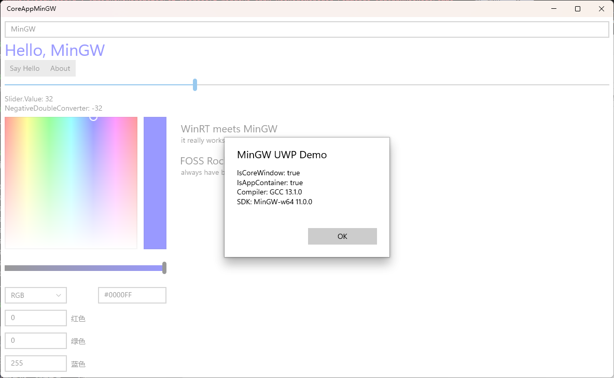

# UWP MinGW Playground

[![Discord Invite][2]][1]

This is a demo of UWP apps (CoreApplication) on MinGW.



## Why

Originally, to stress test the new C++/WinRT MinGW support mostly, also it is fun.

Now, to give coding agents on Linux the ability to easily build and deploy to UWP targets.

## Build

To build this, you'll need the following:

- CMake.
- `llvm-mingw`. Some dependencies are known to crash GCC.
- Windows 10 SDK for Windows hosts, required for `makeappx.exe`.
- Ninja, if you use the default presets.

With these, just build using CMake:

```cmd
cmake --preset Release-x64
cmake --build bin/Release/x64
```

## Deploy

### Locally

On a compatible Windows host, simply run:

```cmd
cmake --install bin/Release/x64
```

This will (re-)install the AppX file and launch the application.

### Remotely

First, run the same install command above.

You should then add the `.cer` file to the Local Machine Trusted Root Certification Authorities
store. After that, install the `.appx` file.

If that does not work (especially on newer Windows 11 builds), you can use the `Add-AppxPackage`
PowerShell cmdlet for this.

The app has been tested to be working on RS2+ Desktop and Mobile.

## Packaging

By default, the install command creates an AppX package at `out/${Configuration}/${Architecture}`.

The package is signed with the key in `src/UWPMinGWPlayground.pfx` using
[`ccky`](https://github.com/trungnt2910/SignToolPlayground).

## Status

### What Works

- XAML layout (load in **runtime** only)
- `IValueConverter` (initialized in code-behind)
- Data binding with `ICustomPropertyProvider` (see `MainWindowViewModel.cpp` and `Property.hpp` on
how to implement this, it sucks but eh)
- `ICommand`
- Setting events from code-behind

### What Doesn't

- Compiled XAML and `x:Bind`
- Automatically generated control references via `x:Name` (so you'll need to crawl through the
logical tree to get to your controls)
- Anything else? Feel free to hack around

## Acknowledements

Thanks to ([**@driver1998**](https://github.com/driver1998)) for the original
[`CoreAppMinGW`](https://github.com/driver1998/CoreAppMinGW) demonstration.

## Community

This repo is a part of [Project Reality][1].

Need help using this project? Join me on [Discord][1], and let's find a solution together.

[1]: https://reality.trungnt2910.com/discord
[2]: https://img.shields.io/discord/1185622479436251227?logo=discord&logoColor=white&label=Discord&labelColor=%235865F2
